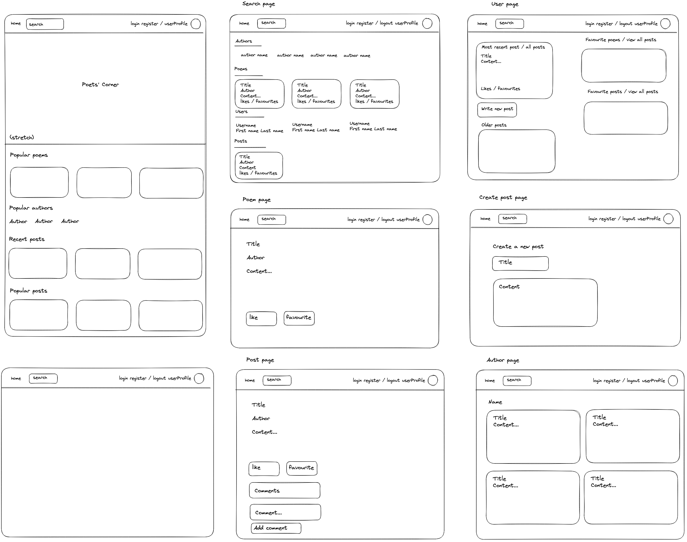
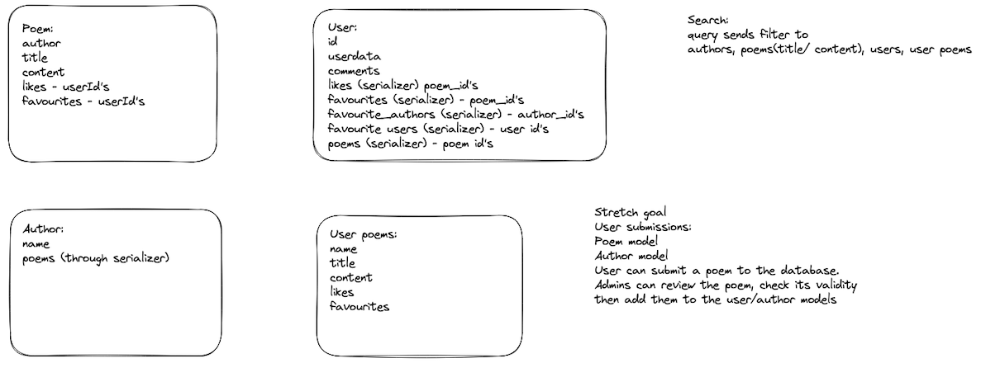

# General Assembly Project 4

### Table of Contents
* [Description](#description)
    - [Deployment Link](#deployment-link)
    - [Code Installation](#code-installation)
    - [Timeframe and Working Team](#timeframe-and-working-team)
    - [Technologies Used](#technologies-used)
    - [Brief](#brief)
* [Planning](#planning)
    - [Styling](#styling)
    - [Finding a dataset](#finding-a-dataset)
* [Build Process](#build-process)
    - [Seeding the database](#seeding-the-database)
    - [Handling the data](#handling-the-data)
    - [Setting up the frontend](#setting-up-the-frontend)
    - [The browse page](#the-browse-page)
    - [Styling](#styling)
    - [Stretch Goals](#stretch-goals)
* [Challenges](#challenges)
* [Wins](#wins)
* [Key Learnings](#key-learnings)
* [Bugs](#bugs)
* [Future Improvements](#future-improvements)

# Description

This project was the last assignment that we were given as part of the Software Engineering Immersive course at General Assembly, in which we had to implement what we had learnt about creating a Django/ PostgreSQL backend, as well as develop our skills in creating a React.js frontend. My idea for the project was a database for poems which users could browse, add their favourite poems to their profiles, write and share posts and read other users' posts.

### Deployment Link 

https://poetscorner.netlify.app

### Code Installation

#### For the frontend:
- Make sure that you have installed Node.js.
- Download the code onto your computer.
- Open your terminal and navigate to the root path of the project.
- Run `npm install` then `npm start`.

#### For the backend:
https://github.com/samcurteis/ga-project-4-backend
- Make sure that you have installed Python and Pip.
- Download the code onto your computer.
- Open your terminal and navigate to the root path of the project.
- Run `pipenv shell` and then `python settings.py runserver`

### Timeframe and Working Team

The timeframe for this project was 9 days and I chose to work solo on it.

### Technologies Used

The app is built using Django, PostgreSQL, and React.js. It is styled using Material UI and SASS, and uses various packages installed using npm and pip, including JWT, Axios, Buffer, CORS, and Dotenv.

### Brief

Our brief was as follows:
- Build a full-stack app with a Python Django API that uses Django REST Framework to serve data from a PostgreSQL database.
- The API must be consumed by a separate frontend built with React.js.
- The app must have multiple relationships between multiple models.
- The app must implement CRUD functionality.

## Planning

After coming up with my initial idea of creating a database for quotes, I drew out a wireframe of the pages I intended to create.

<p align='center'>

</p>

I also wrote some pseudocode of what I wanted the backend models to look like.

<p align='center'>

</p>

### Styling

With the previous projects that I had completed, because the creation of components and implementing CRUD functionality was the most challenging aspect of building the app, styling tended to be implemented fairly last minute, meaning I ended up with an app that in terms of functionality I was quite proud of, but I didn’t feel super satisfied when it came to design and wish I had done more. To make sure this didn’t happen again I focussed at the planning stage on setting MVP functionality goals that were actually minimal, while also setting MVP design goals which would be completed before moving on to any additional features. 

### Finding a dataset

After setting out a rough wireframe of what I wanted the backend and frontend to look like, I started searching for a dataset to populate my app that fitted well with what I wanted for it. In my previous project my peer, Nathan, showed me how you can pull a .csv file from the internet and use it to seed your database.

With my initial idea of creating an app for quotes, I found some datasets, but none that fitted exactly with what I wanted for the app. I then remembered that Project Gutenberg publishes literature for free, and thought that poetry could be a fitting alternative. After some searching, I found a dataset of over 15,000 poems that would fit perfectly.

## Build Process

### Seeding the database

For seeding the database I found a method that uses a scripts folder and load.py file. One dilemma I had however is that I wanted to have data not just on poems but also on authors so that users could search by author and also see all the poems that one author has on the website. I got around this problem by using the get_or_create method so that authors would not be duplicated.

```
    for poem in read_file:
             if count == 1:
                 pass
             else:
                 author, created = Author.objects.get_or_create(name=poem[1])
                 Poem.objects.create(
                     author=Author.objects.get(name=poem[1]), title=poem[2], content=poem[4])
             count = count+1
```

### Handling the data

Throughout this project, because of the amount of data stored in the database, I had to think of various ways of handling the data in the back end to make sure that requests were as efficient as possible, so that rather than calling the entire dataset for poems on the front end and then handling it client-side, the front end could receive only exactly what it needed when it made a call.

I found various ways of doing this, such as ordering the data by favourites and then calling only the first six items for the most popular poems, authors and posts.

```
def get(self, _request):
        poems = Poem.objects.order_by('poem_favorites')[:6]
        serialized_poems = PopulatedPoemSerializer(poems, many=True)
        return Response(serialized_poems.data, status=status.HTTP_200_OK)
```

I also added reduced serializers which I would use when calling a lot of data to make sure that I was receiving nothing more than I needed to maximise efficiency.

```
class ReducedPoemSerializer(serializers.ModelSerializer):
         class Meta:
             model = Poem
             fields = ('title', 'author', 'id')
```

### Setting up the frontend

I was able to get the backend up and running fairly quickly and began working on the frontend. I began by building the aspects of the app which I had built before in previous apps and could be easily lifted and shifted, such as the login and register components. I then began the bulk of the project, which was building components for post, poem, author and user pages, as well as a search page.

### The browse page

After completing the search page I realised that users could only find content if they knew what to search for, and there was no way for users to discover authors or poems that they didn’t know about. I had created index pages before but none that handled such large amounts of data, so I had to find a way of splitting the data into smaller chunks that could be easier to surf.

 I decided to arrange them into alphabetical categories, but whereas before I might have used a filter function on the frontend to achieve this, I realised that would not be ideal in this circumstance as it would mean calling all of the data at once, which slowed down the speed of the app significantly. To resolve this issue I thought I would see if there’d be a way of doing the same thing in the backend, and came across Django’s `startswith` filter option, as well as ‘Q’, which allowed me to exclude ‘the’ at the beginning of poems which would overpopulate the ‘T’ category.

 ```
 class PoemIndexSearchView(APIView):
         def get(self, request):
             query = request.GET.get('search')
             results = Poem.objects.filter(Q(title__istartswith=query) | Q(
                 title__istartswith=f"the {query}"))
             serialized_results = ReducedPopulatedPoemSerializer(results, many=True)
             return Response(serialized_results.data)
```

By filtering through the data on the backend, I again managed to ensure that the frontend would process as little as possible and thus improve the speed of loading.

### Styling

As mentioned in the planning section, I wanted to make sure that the app not only worked well but also looked good. To decide on my theme I first explored some colour palette websites to help me decide which colours I wanted for the website. 

I really liked the design of the Poetry Foundation’s website in the way that it mimicked the simple black and white of a poetry book, while still keeping it bright with dashes of red across the site. I took inspiration from this while keeping my app unique by going for a black-and-white design, with an orange logo and orange text when a user hovers over a link. I also opted for two fonts, one serif and one sans-serif so the site had a sense of being literary but also modern.

In the initial building of components, to get something looking fairly decent while still focussing on functionality, I used Material UI. I separated the fonts by applying one to standard HTML components through CSS, and one to MUI components so that I could interchange them easily.

When I got to the point of customising the design of my app, however, the documentation on the MUI website and other people’s suggestions for solutions to applying custom styles seemed overly complicated, and I felt determined to find a simple and easy way of doing it. I eventually discovered a solution which involved creating a common component which imported an MUI component and passed its keys through as props. The suggestion I found however still involved applying specific styles to the common component within each page that they were being called, which meant I would have to write the same custom styles for every page on which they featured.

Through some experimentation however, I found a way of applying global styles within the custom component, as well as having the option of passing in styles where I call the component so that I can modify them where necessary. I did this by setting the `sx` prop as an array which includes both the passed-in styles as well as the globally set styles. This worked perfectly as a means of creating buttons and typography that would show my choice of orange when the user hovers over the text, indicating that it is a link which they can click on, creating consistency of style across the platform.

```
import React from 'react';
     import { Typography } from '@mui/material';
    
     export default function CommonTypography({
       children,
       onClick,
       color,
       size,
       name,
       id,
      className,
      sx
    }) {
      const styles = {
        color: 'black',
        '&:hover': { color: '#ef7b45', cursor: 'pointer' }
      };
      return (
        <Typography
          className={className}
          onClick={onClick}
          color={color}
          size={size}
          id={id}
          name={name}
          sx={[sx, styles]}
        >
          {children}
        </Typography>
      );
    }
   ```


### Stretch Goals

Once I had formatted each page, mostly using flexbox through CSS and inline MUI styles, and applied my custom theme, I then moved on to some stretch goals. This is when I added special categories to the homepage, mostly using specific backend requests such as ordering poems by most favourites and grabbing only the first six, which can be seen in the first code snippet.

One of these stretch goals was giving admin users the ability to apply CRUD functionality to the poetry and author database. A lot of poems included unwanted footnotes, inactive links to audio files or unnecessary spacing, and it was rather tedious editing the seed file and reseeding or modifying them through Postman. I had already created a new post page, which doubled as an edit page, passing in the post to edit as the initial value of the form data, or removing the post to edit if the user clicked on the ‘write a new post’ button instead of an ‘edit post’ button. If a post to edit is passed into the component, it will then run a put request when the user clicks submit, or a post request if there isn’t.

```
export default function NewPostPage({ singlePost }) {
       const navigate = useNavigate();
       const goBack = () => navigate(-1);
       const [formData, setFormData] = useState({
         title: '',
         content: ''
       });
    
       useEffect(() => {
         singlePost &&
          setFormData({
            title: singlePost.title,
            content: singlePost.content
          });
      }, [singlePost]);
   
      const postTemplateData = {
        post_likes: [],
        post_favorites: [],
        comments: []
      };
   
      const [error, setError] = useState(false);
   
      const handleChange = (e) => {
        setFormData({ ...formData, [e.target.name]: e.target.value });
      };
   
      const handleSubmit = (e) => {
        e.preventDefault();
        singlePost ? editPost() : createPost();
      };
```

For the new poem/ edit poem component I therefore implemented the same idea, but had the additional problem of having to select an author, which would just be the current user in the case of a post. I wanted the user to be able to choose from a list of already existing authors, but also have the option of entering a new author if the author they wanted wasn’t already on the site. If the author exists I would need their id to be added to the form data, but if it didn’t exist I would need the component to make a post request for a new author, take the id for that new author and then add it to the form data for a new poem.

I did this by setting up a variable ‘foundAuthor’ within an MUI dropdown menu that would be populated by an array of all authors. This variable would search the authors array for the value input by the user.

I then used a ternary operator to set the form data as either the id of the found author, or the new value input by the user if no author was found. 
``` 
<Autocomplete
        sx={{ mb: 2 }}
        freeSolo
        autoSelect
        value={singlePoem?.author.name}
        options={authors?.map((author) => ({
        id: author.id,
        label: author.name
            }))}
        renderInput={(params) => <TextField {...params} label='Author' />}
        onChange={(event, value) => {
                const foundAuthor = authors.filter(
                      (author) => author.name === value
                    );
                foundAuthor.length > 0
                    ? setFormData({ ...formData, author: foundAuthor[0].id })
                    : setFormData({ ...formData, author: value });
                foundAuthor.length > 0
                    ? setFoundAuthor(true)
                    : setFoundAuthor(false);
                  }}
                />
```

The code I wrote into the edit and create poem API call functions I felt was overly verbose and could do with refactoring, but overall I felt quite satisfied by the solution I had come up with for creating a dynamic component for creating and editing poems, as well as authors.

## Challenges

Overall I was very satisfied with this project as it posed quite several new problems which I hadn’t come across before, but which I feel like I overcame and learned from. Three notable challenges from this project I would say were:

- Having to address the processing issues that came with handling large amounts of data.
- Finding ways of benefiting from the built-in design features of MUI components while still maintaining the flexibility of setting global styles that comes with CSS and SASS.
- The complexity that comes with creating components that serve the function of more than one page.

If you would like more detail on how I addressed these challenges, I wrote more about them in the build process section of this readme. Overall I don’t think that my solutions to these challenges are perfect and I am eager to go back to them to think of ways that they could be improved, but I feel like I learned a lot by finding ways they could be addressed.

## Wins

Although the app does not run perfectly and has some flaws I overall took a lot of wins from it.

- I’m glad that from the start I set out to make sure that the design was of a similar standard as the features and feel like I achieved this, improving upon the shortcomings of previous projects.
- I’m very happy with the idea of the app, as I really enjoy browsing sites such as the Poetry Foundation but have always wanted a place where I can store all of my favourite poems. The Poetry Foundation also has no way for users to interact with each other. As poetry is a fairly niche interest and it’s not easy to find other people who share it, I feel like a site that aims to foster a community based on poetry could be something new and of interest to those interested in poetry.
- This project solidified what I had previously learned in building full-stack apps, while also pushing me to think of solutions for new features and problems.

## Key Learnings

- With this project, I feel like I got a better grip on implementing and sticking to a solid plan from the start and prioritising features more appropriately. 
- This being the third project I have done using React.js, I also feel like I have become much more comfortable with using it, as well as the fundamentals of Django and PostgreSQL.
- I learned a lot about how to best use Material UI, and aim in the future to have a better idea from the start about how I am going to use it and to what extent I need to use it.
- Although I still feel like there’s much to learn, I also think I learned a good deal about the challenges posed when handling large amounts of data and having to optimise frontend processing.

## Bugs

As I was eager to fit in various stretch goals and add finishing touches to the design, I was not able to fully test the app once it was completed, as such there are occasional inconsistencies, particularly when using the app on a mobile phone. The dropdown button for poems in the search page will occasionally appear or disappear when it shouldn’t, and the register or edit pages will stop loading or reload without input from the user. With previous projects, I have left the code exactly as it was when I finished the project, but for this project I have gone through and made fixes where I have found small bugs, as I am often showing it to people who may be interested in the app. If you come across any bugs then please do let me know!

## Future Improvements

After finishing the app and browsing it to test out the control flow and user experience, there are various features on the app which I would like to add or improve upon.

- When using the search bar, the enter key does not run the search, so users often assume that the search does not work. The first thing I would do is link the enter key to the API call and navigation function, as this would be an easy but also very important fix.
- There is no feedback to the user on the registration page if something is wrong with their details, so they have no way of knowing what to change if, for example, the passwords do not match. The password inputs are also not recognised by some automatic password input apps. 
- Throughout the app, there are various inefficiencies where unnecessary API calls are made which slow down the app, most likely due to useEffect hooks being called when they shouldn’t be. This slows down the app unnecessarily so I would look to make sure only necessary API calls are made.
- For a user that doesn’t know anything about the site, there is no page that explains to them what the app is and what they can do with it, meaning that when I show the app to friends or family they have tended to be fairly nonplussed about what it contains or how to explore and engage with it. 
- A feature which I wanted to implement from the beginning was the ability for users to request to admin users that a poem or author be added to the database, or a current poem or author be edited. 
- The option for admin users to edit the name of any current authors.
- Functionality for users to send messages to each other.


